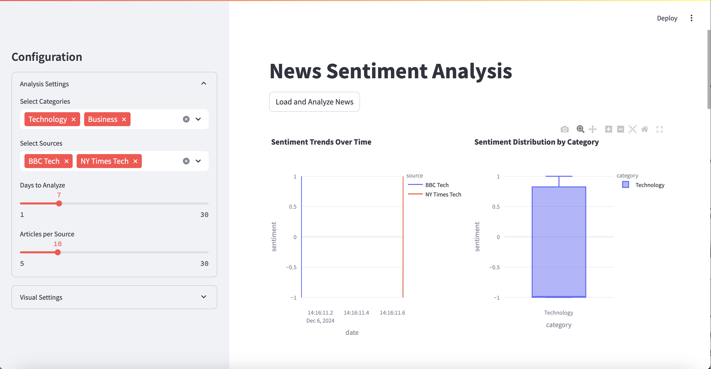
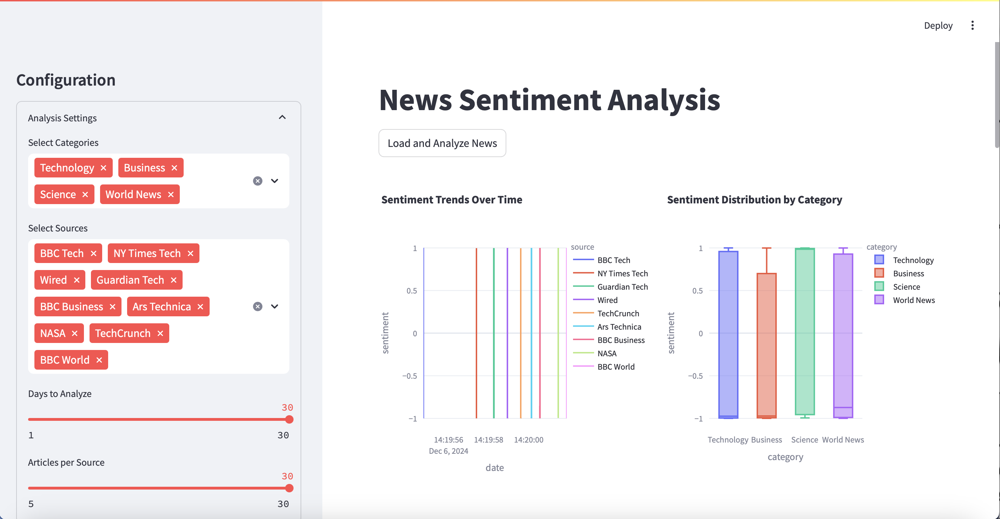
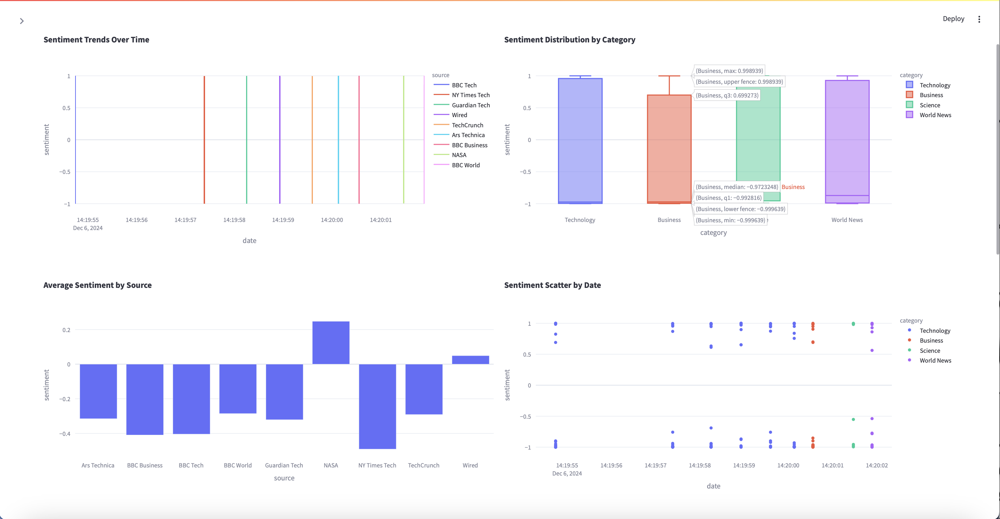
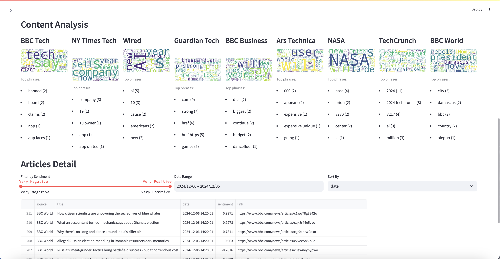
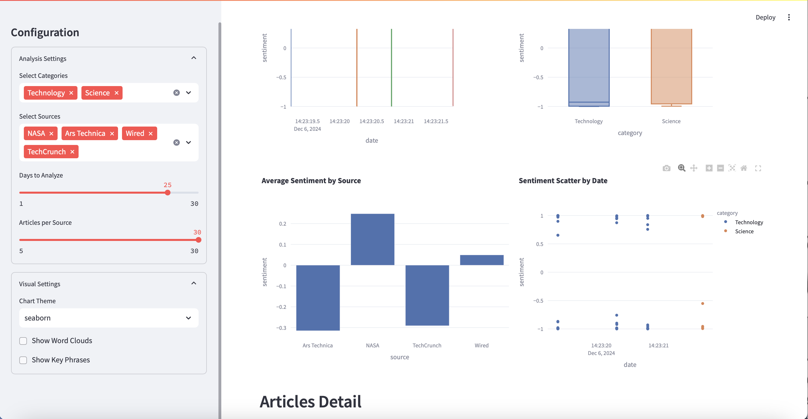

Welcome to News Sentiment Analysis! Check it our [here](news-sentiment-analysis.streamlit.app).

Want to see how some of the top newspapers are faring today? By scraping information and applying machine learning on the processed data, this app will analyze these newspapers.

See the average sentiment of each source and the selected categories as a whole.

View word clouds and details about specific articles: you can filter your selection by the sentiment, date range, or how you want it sorted.

Make the dashboard your own! Decide whether you want to see the word clouds and key phrases (shown by default) and whether you prefer plotly graphs (see screenshots above) or seaborn plots (see screenshot below).

Remember: all of these widgets are interactable! Feel free to hover over the plots to see the data, zoom in, pan around, go fullscreen, or download the plot to your computer.